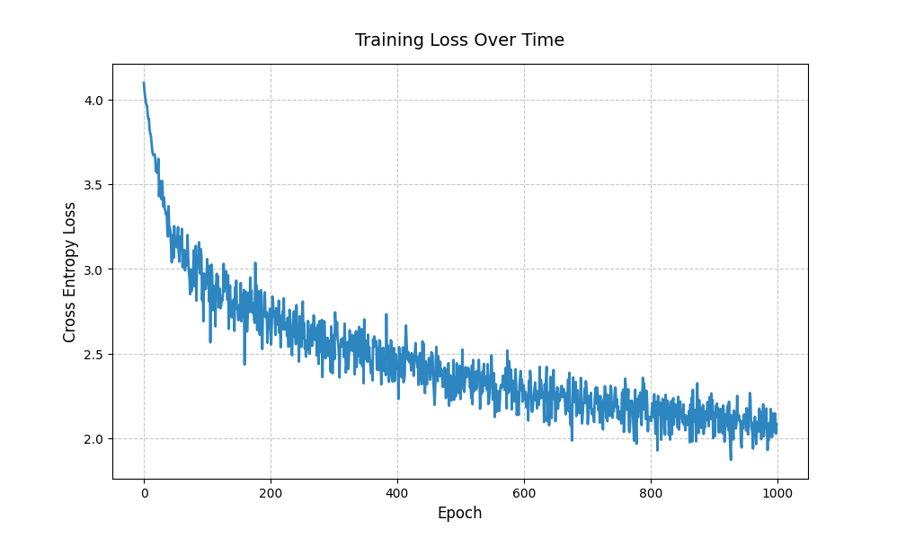
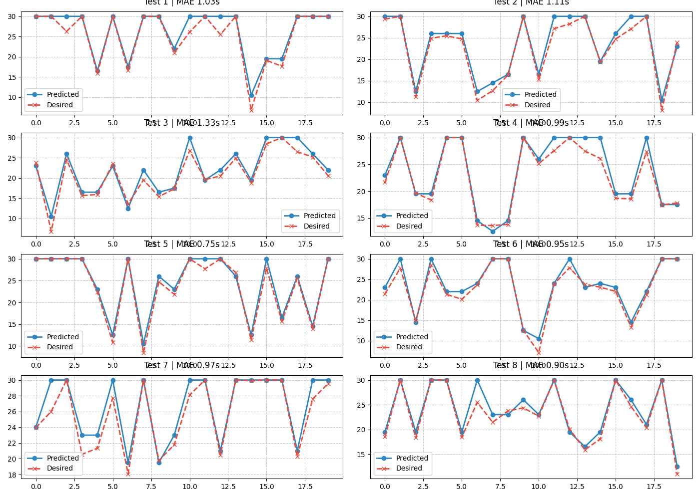
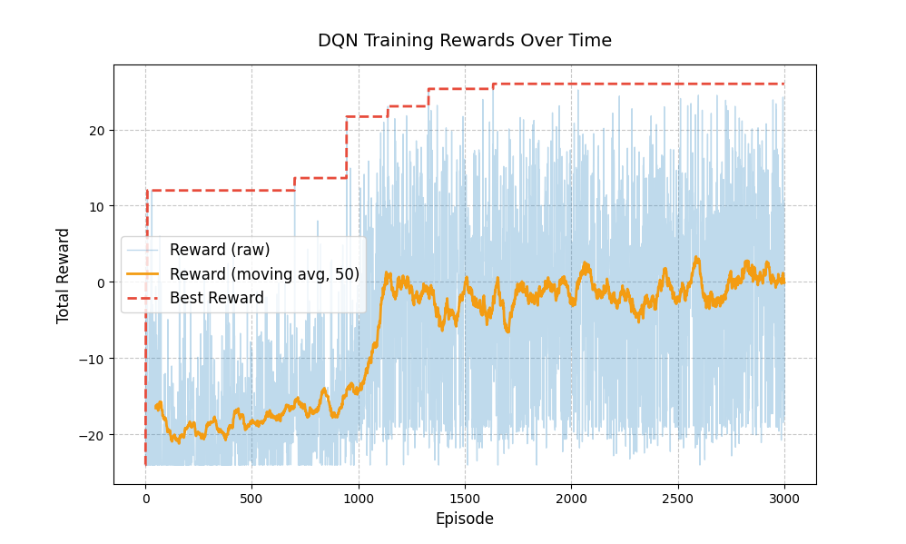
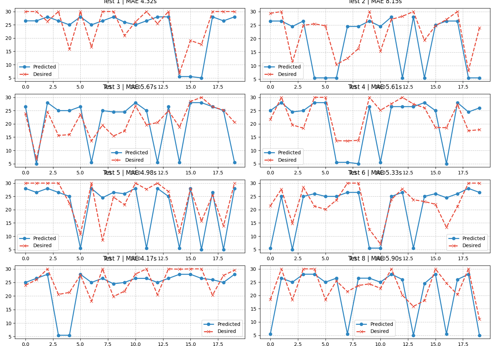
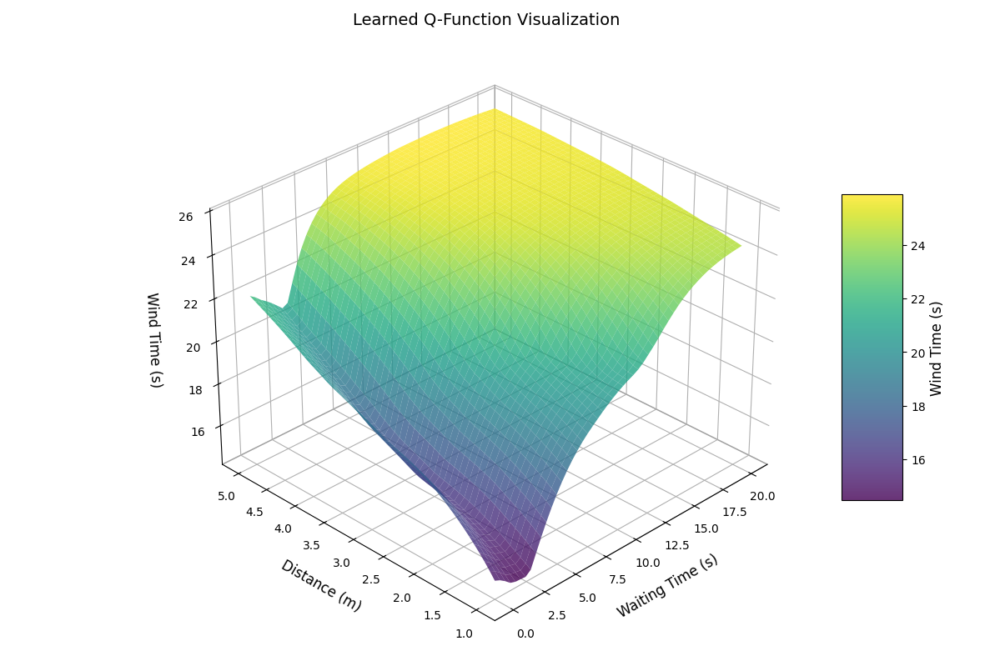

# Fan Control DQN Project

### 🚧 This is a research repository. Unauthorized use, reproduction, or distribution is strictly prohibited.

This project implements a hybrid learning system that combines DQN (Deep Q-Network) and Imitation Learning for fan control. Below are the actual experimental results, visualizing the learning process and performance through various graphs.

## Synergy of Imitation Learning and Reinforcement Learning in Fan Control

### Research Background and Motivation

Control problems in real-world environments must simultaneously satisfy two critical requirements:

1. **Policy Stability**: The controlled object (fan) must demonstrate safe and consistent behavior.
2. **Policy Adaptability and Optimality**: The system must flexibly respond to changes in user environment or conditions while maximizing rewards.

These requirements are difficult to achieve effectively with a single learning approach. Therefore, this project adopts a hybrid learning strategy combining **Imitation Learning (IL)** and **Reinforcement Learning (RL)**.

### Sparsity of Human Feedback and Value of Imitation Learning

In human-centered interaction environments like fan control, user satisfaction is the most important metric. However, this satisfaction is difficult to use directly as a reward function in reinforcement learning for the following reasons:

1. **Subjectivity and Variability**: Each person's perception of "comfort" varies in terms of time and angle, and changes with circumstances.
2. **Quantification Challenges**: Expressing satisfaction numerically or collecting real-time feedback continuously faces technical and human constraints.
3. **Data Sparsity**: Collecting actual user feedback is costly, and the amount of collectable data is limited.

For these reasons, **Imitation Learning** is particularly effective. It models human preference patterns from limited human feedback data and pre-learns policies that approximate satisfaction.

### Role of Imitation Learning

1. **Knowledge-Based Initialization**
   - Learns initial policies reflecting fan operation principles and human preferences using expert control data
   - Infers high-level strategies from limited human feedback data

2. **Exploration Risk Minimization**
   - Prevents abnormal control behaviors that could result from random actions during initial RL exploration
   - Ensures critical stability requirements, especially important in actual hardware

3. **Learning Acceleration**
   - Explores based on policies that already work "human-like" rather than from a no-policy state
   - Significantly improves sample efficiency

### Role of Reinforcement Learning

1. **Reward-Based Policy Improvement**
   - Policies obtained through Imitation Learning only replicate expert behavior without optimization goals
   - Performs practical optimization based on objective functions such as user satisfaction and energy efficiency

2. **Adaptability to Various Situations**
   - Learns policies that flexibly respond to various environmental conditions (distance, user location, time changes, etc.)
   - Compensates for potential generalization failures in Imitation Learning-only models

### Synergy Effects of Combination

| Approach | Advantages | Disadvantages |
|----------|------------|---------------|
| Imitation Learning (IL) | Fast and stable initial learning | No optimization objective |
| Reinforcement Learning (RL) | Reward-based optimization possible | Unstable initial exploration |

The combination of these approaches provides the following synergies:

1. **Stable Initialization + Adaptive Optimization**
   - Secures stability and human-like control from IL
   - Achieves reward optimization and generalization from RL

2. **Efficient Learning**
   - Narrows RL's exploration space and improves convergence speed through IL initialization
   - Mitigates sample inefficiency problems

3. **Practicality and Scalability Enhancement**
   - Generates policies with reliability and performance suitable for real hardware fan control systems beyond laboratory level

## Project Structure

```
project/
├── src/
│   ├── models/
│   │   ├── dqn.py         # DQN model and learning related code
│   │   └── imitation.py   # Imitation learning related code
│   ├── environment/
│   │   └── trading_env.py # Environment class
│   ├── utils/
│   │   └── visualization.py # Visualization related code
│   └── config/
│       └── settings.py    # Hyperparameters and settings
├── tests/
├── requirements.txt
└── README.md
```

## Installation

1. Install required packages:
```bash
pip install -r requirements.txt
```

## Usage

1. Create main.py file

Create a `main.py` file in the project root (top-level folder) as follows:

```python
from src.models.imitation import imitation_train
from src.models.dqn import dqn_train
from src.utils.visualization import plot_training_loss, test_dqn_policy, plot_dqn_policy_3d

# Run Imitation Learning
model, losses = imitation_train()
plot_training_loss(losses)

# Run DQN Learning
q_net, rewards = dqn_train(model)

# Visualize Results
test_dqn_policy(q_net)
plot_dqn_policy_3d(q_net)
```

2. Execution

Run the following command in the terminal:

```bash
python main.py
```

## Performance Results

### 1. Imitation Learning Performance

- **Imitation_Loss.png**  
  Loss function decrease trend during Imitation Learning process.  
  

- **Imitation_Performance.png**  
  Prediction performance of Imitation Learning model (results on test data).  
  

### 2. Reinforcement Learning (DQN) Performance

- **DQN_Rewards.png**  
  Episode-wise reward changes, moving average, and maximum reward trends of DQN agent.  
  

- **DQN_Performance.png**  
  Test performance of DQN policy (prediction results on various test data).  
  

- **DQN_3D_Performance.png**  
  3D visualization of the policy learned by DQN.  
  

## Key Features

- Initial policy learning through Imitation Learning
- Reinforcement Learning using DQN
- Visualization of learned policies
- Performance evaluation and analysis

## Conclusion

- Rapid initial policy learning was achieved through Imitation Learning
- Additional performance improvement was achieved through Reinforcement Learning by maximizing rewards in the actual environment
- The above graphs intuitively show the learning process and final policy performance

## Note
- All graph images are automatically generated during code execution. 